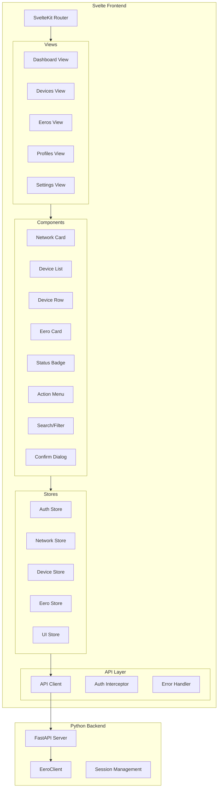
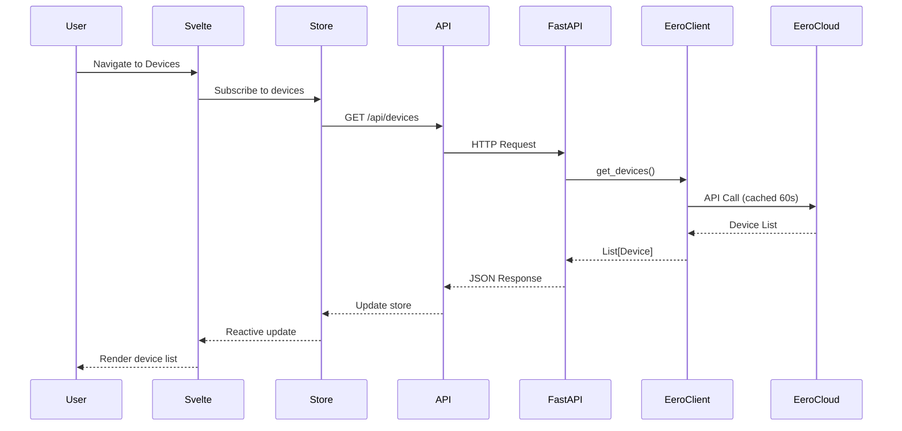
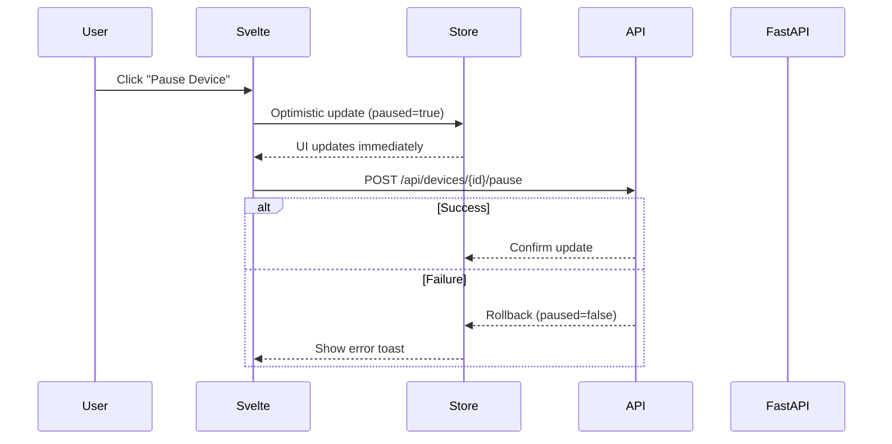

# Eero UI - Architecture

> **Note:** This dashboard depends on [eero-client](https://github.com/fulviofreitas/eero-client), an async Python client for the Eero API.

**Version:** 1.0.0 | **Status:** Design | **Updated:** January 2026

---

## 1. High-Level Architecture

```
┌─────────────────────────────────────────────────────────────────────────────────┐
│                           EERO DASHBOARD BOUNDARY                                │
├─────────────────────────────────────────────────────────────────────────────────┤
│                                                                                  │
│  ┌─────────────────────────────────────────────────────────────────────────┐    │
│  │                        SVELTE FRONTEND (SPA)                             │    │
│  ├─────────────────────────────────────────────────────────────────────────┤    │
│  │  ┌─────────────┐   ┌─────────────┐   ┌─────────────┐   ┌─────────────┐  │    │
│  │  │    Views    │   │ Components  │   │   Stores    │   │ API Client  │  │    │
│  │  │  (Routes)   │   │    (UI)     │   │   (State)   │   │  (Fetch)    │  │    │
│  │  └──────┬──────┘   └──────┬──────┘   └──────┬──────┘   └──────┬──────┘  │    │
│  │         └─────────────────┴─────────────────┴─────────────────┘         │    │
│  └─────────────────────────────────────────────────────────────────────────┘    │
│                                       │                                          │
│                                       ▼ HTTP/REST                               │
│  ┌─────────────────────────────────────────────────────────────────────────┐    │
│  │                      PYTHON API PROXY (FastAPI)                          │    │
│  ├─────────────────────────────────────────────────────────────────────────┤    │
│  │  ┌─────────────┐   ┌─────────────┐   ┌─────────────┐                    │    │
│  │  │   Routes    │   │   Deps      │   │  EeroClient │                    │    │
│  │  │  (REST)     │◄──│   (Auth)    │──►│  (Wrapper)  │                    │    │
│  │  └─────────────┘   └─────────────┘   └──────┬──────┘                    │    │
│  └─────────────────────────────────────────────┼────────────────────────────┘    │
│                                                │                                 │
└────────────────────────────────────────────────┼─────────────────────────────────┘
                                                 │ HTTPS/TLS
                                                 ▼
                              ┌───────────────────────────────┐
                              │     EERO CLOUD API            │
                              │   api-user.e2ro.com           │
                              └───────────────────────────────┘
```

---

## 2. Component Architecture



---

## 3. Design Decisions & Tradeoffs

### Decision 1: Python API Proxy Layer

**Context:** The eero-client is a Python async library. Browsers cannot run Python directly.

**Decision:** Create a thin FastAPI REST wrapper that exposes eero-client functionality.

| Pros | Cons |
|------|------|
| Keeps credentials server-side | Additional deployment complexity |
| Reuses existing eero-client logic | Slight latency overhead |
| Enables session management | Requires Python runtime |
| Future: Add caching, rate limiting | Two processes to manage |

**Alternative Considered:** Rewrite eero-client in JavaScript
- Rejected: Significant effort, duplicate maintenance burden

### Decision 2: Svelte (not SvelteKit SSR)

**Context:** Need a modern, lightweight frontend framework.

**Decision:** Use Svelte with client-side routing (SPA mode).

| Pros | Cons |
|------|------|
| Minimal bundle size (~10KB) | No SSR (acceptable for internal tool) |
| Reactive without virtual DOM | Less ecosystem than React |
| Simple, readable code | Team learning curve |
| Excellent performance | |

**Why not React/Vue:** Svelte offers better performance and simpler mental model for an operations dashboard.

### Decision 3: Svelte Stores for State

**Context:** Need predictable state management without Redux-like boilerplate.

**Decision:** Use Svelte's built-in store system with derived stores.

```typescript
// Example: Derived store for filtered devices
export const filteredDevices = derived(
  [devices, searchQuery, statusFilter],
  ([$devices, $query, $status]) => 
    $devices.filter(d => matches(d, $query, $status))
);
```

| Pros | Cons |
|------|------|
| Zero dependencies | Manual optimization for complex cases |
| TypeScript support | No devtools (vs Redux DevTools) |
| Reactive by default | |
| Simple subscription model | |

### Decision 4: Token-Based Frontend Auth

**Context:** Frontend needs to authenticate with backend proxy.

**Decision:** Session cookie from FastAPI, stored in httpOnly cookie.

| Approach | Security | UX | Implementation |
|----------|----------|-----|----------------|
| httpOnly Cookie | ✅ Secure (no JS access) | ✅ Automatic | ✅ Simple |
| localStorage JWT | ⚠️ XSS vulnerable | ✅ Good | ✅ Simple |
| In-memory only | ✅ Very secure | ❌ Lost on refresh | ⚠️ Complex |

**Tradeoffs of Frontend Auth:**
- ⚠️ Eero session stored on backend (30-day expiry)
- ⚠️ Backend must be trusted (same security boundary)
- ✅ Frontend never sees raw eero credentials
- ✅ Browser refresh preserves session

### Decision 5: Optimistic UI Updates

**Context:** Write operations (pause, reboot) should feel responsive.

**Decision:** Update UI immediately, rollback on failure.

```typescript
async function pauseDevice(deviceId: string) {
  // Optimistic update
  deviceStore.update(d => ({ ...d, paused: true }));
  
  try {
    await api.pauseDevice(deviceId);
  } catch (error) {
    // Rollback on failure
    deviceStore.update(d => ({ ...d, paused: false }));
    throw error;
  }
}
```

---

## 4. Security Model

### Frontend Security Boundaries

```
┌──────────────────────────────────────────────────────────────┐
│                   BROWSER (Untrusted)                         │
│  ┌──────────────────────────────────────────────────────┐    │
│  │ Svelte App                                            │    │
│  │ - No credentials stored                               │    │
│  │ - httpOnly session cookie only                        │    │
│  │ - CSRF protection via SameSite                        │    │
│  └──────────────────────────────────────────────────────┘    │
└───────────────────────────────┬──────────────────────────────┘
                                │ HTTPS only
                                ▼
┌──────────────────────────────────────────────────────────────┐
│               BACKEND PROXY (Trusted Zone)                    │
│  - Eero session tokens stored server-side                    │
│  - Rate limiting                                              │
│  - Request validation                                         │
│  - Audit logging                                              │
└──────────────────────────────────────────────────────────────┘
```

### Security Controls

| Control | Implementation |
|---------|----------------|
| No hardcoded credentials | ✅ All tokens server-side |
| HTTPS enforcement | ✅ FastAPI + reverse proxy |
| CSRF protection | ✅ SameSite=Strict cookies |
| XSS prevention | ✅ Svelte auto-escapes |
| Session timeout | ✅ 30-day eero session, 24h app session |

### Auth Risks & Mitigations

| Risk | Severity | Mitigation |
|------|----------|------------|
| Session hijacking | 🔴 High | httpOnly + Secure cookies |
| CSRF attacks | 🟡 Medium | SameSite cookies + Origin check |
| Token leakage in logs | 🔴 High | Backend masks tokens |
| Stale session | 🟡 Medium | Auto-refresh, clear error handling |

---

## 5. Data Flow

### Read Operations



### Write Operations (Optimistic)



---

## 6. File Structure

```
eero-ui/
├── frontend/                      # Svelte SPA
│   ├── src/
│   │   ├── lib/
│   │   │   ├── api/              # API client layer
│   │   │   │   ├── client.ts     # HTTP client with interceptors
│   │   │   │   ├── types.ts      # TypeScript interfaces
│   │   │   │   └── endpoints.ts  # API endpoint definitions
│   │   │   ├── stores/           # Svelte stores
│   │   │   │   ├── auth.ts       # Authentication state
│   │   │   │   ├── network.ts    # Network data
│   │   │   │   ├── devices.ts    # Device data + actions
│   │   │   │   ├── eeros.ts      # Eero node data
│   │   │   │   └── ui.ts         # UI state (filters, modals)
│   │   │   ├── components/       # Reusable UI components
│   │   │   │   ├── layout/       # Header, Sidebar, etc.
│   │   │   │   ├── network/      # Network-specific components
│   │   │   │   ├── device/       # Device-specific components
│   │   │   │   ├── eero/         # Eero node components
│   │   │   │   └── common/       # Buttons, Badges, etc.
│   │   │   └── utils/            # Helpers
│   │   ├── routes/               # SvelteKit routes
│   │   │   ├── +layout.svelte    # Root layout
│   │   │   ├── +page.svelte      # Dashboard
│   │   │   ├── devices/          # Device views
│   │   │   ├── eeros/            # Eero node views
│   │   │   └── settings/         # Settings views
│   │   ├── app.css               # Global styles
│   │   └── app.html              # HTML template
│   ├── static/                   # Static assets
│   ├── package.json
│   ├── svelte.config.js
│   ├── vite.config.ts
│   └── tsconfig.json
│
├── backend/                       # FastAPI proxy
│   ├── app/
│   │   ├── __init__.py
│   │   ├── main.py               # FastAPI app
│   │   ├── config.py             # Configuration
│   │   ├── deps.py               # Dependencies (auth, client)
│   │   ├── routes/
│   │   │   ├── __init__.py
│   │   │   ├── auth.py           # Login/logout
│   │   │   ├── networks.py       # Network operations
│   │   │   ├── devices.py        # Device operations
│   │   │   ├── eeros.py          # Eero node operations
│   │   │   └── profiles.py       # Profile operations
│   │   ├── models/
│   │   │   ├── __init__.py
│   │   │   └── schemas.py        # Pydantic schemas
│   │   └── services/
│   │       ├── __init__.py
│   │       └── eero_service.py   # EeroClient wrapper
│   ├── requirements.txt
│   └── Dockerfile
│
├── docker-compose.yml             # Optional: Full stack deployment
└── README.md
```

---

## 7. Performance Targets

| Metric | Target | Strategy |
|--------|--------|----------|
| Initial Load | < 200ms | Code splitting, lazy routes |
| API Response (cached) | < 50ms | Backend 60s cache |
| API Response (fresh) | < 500ms | Eero API latency |
| Device List Render | < 16ms | Virtual scrolling for 100+ devices |
| Action Feedback | < 100ms | Optimistic updates |
| Bundle Size | < 50KB gzip | Svelte minimal footprint |

---

## 8. Future Considerations

### Multi-Account Support

Current design uses single EeroClient instance. For multi-account:

```python
# backend/services/account_manager.py
class AccountManager:
    def __init__(self):
        self._clients: Dict[str, EeroClient] = {}
    
    async def get_client(self, account_id: str) -> EeroClient:
        if account_id not in self._clients:
            self._clients[account_id] = await self._create_client(account_id)
        return self._clients[account_id]
```

Frontend would add account selector to stores:

```typescript
// Selected account ID
export const currentAccount = writable<string | null>(null);

// Devices filtered by account
export const devices = derived(
  [allDevices, currentAccount],
  ([$all, $account]) => $all.filter(d => d.accountId === $account)
);
```

### WebSocket for Real-Time

Replace polling with WebSocket for live updates:

```typescript
// Future: WebSocket store
const ws = new WebSocket('/api/ws');
ws.onmessage = (event) => {
  const update = JSON.parse(event.data);
  if (update.type === 'device_status') {
    deviceStore.update(d => ({ ...d, [update.id]: update.data }));
  }
};
```

---

## 9. Deployment Options

### Option A: Single Process (Recommended for Small Teams)

```bash
# Run FastAPI with static Svelte build
uvicorn app.main:app --host 0.0.0.0 --port 8000
# Svelte build served from /static
```

### Option B: Separate Services

```yaml
# docker-compose.yml
services:
  frontend:
    build: ./frontend
    ports: ["3000:3000"]
  
  backend:
    build: ./backend
    ports: ["8000:8000"]
    environment:
      - EERO_COOKIE_FILE=/data/session.json
    volumes:
      - eero-data:/data
```

### Option C: Serverless (Future)

- Frontend: Vercel/Netlify static
- Backend: AWS Lambda + API Gateway
- Session: Redis/DynamoDB
