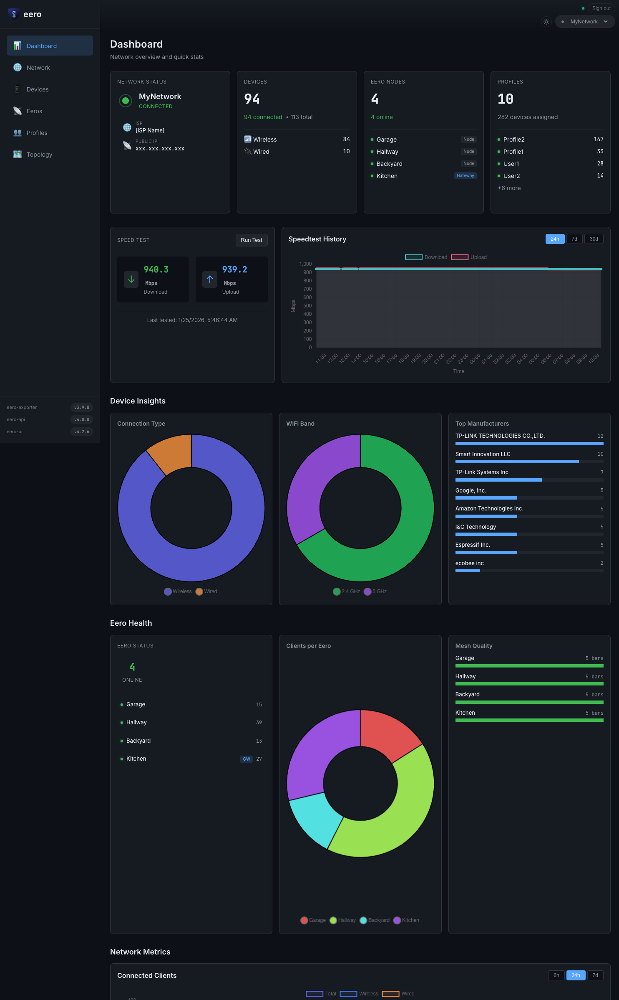
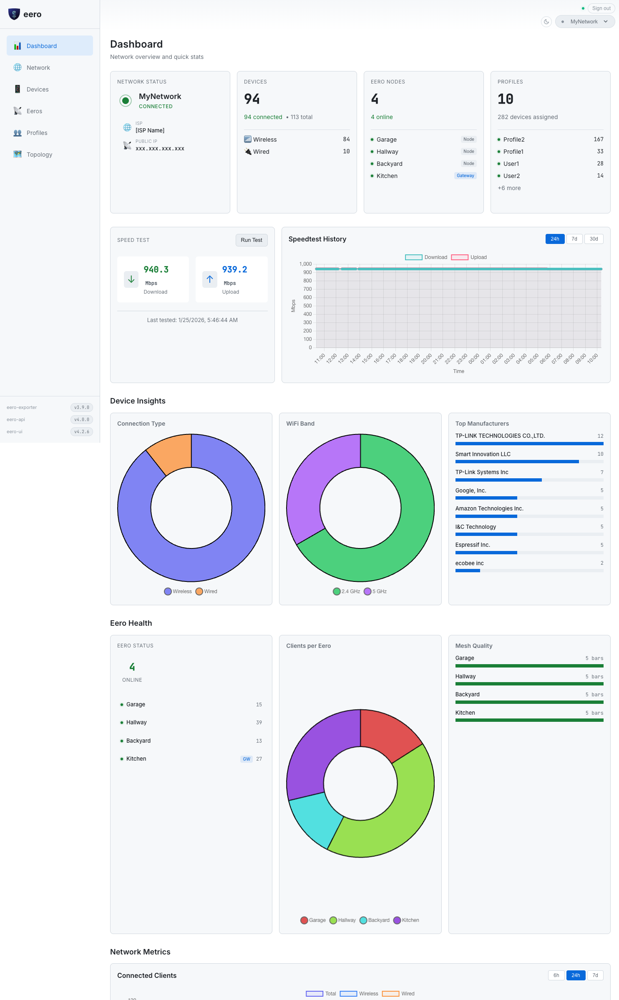
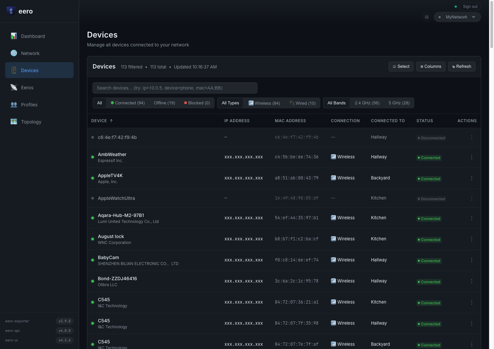
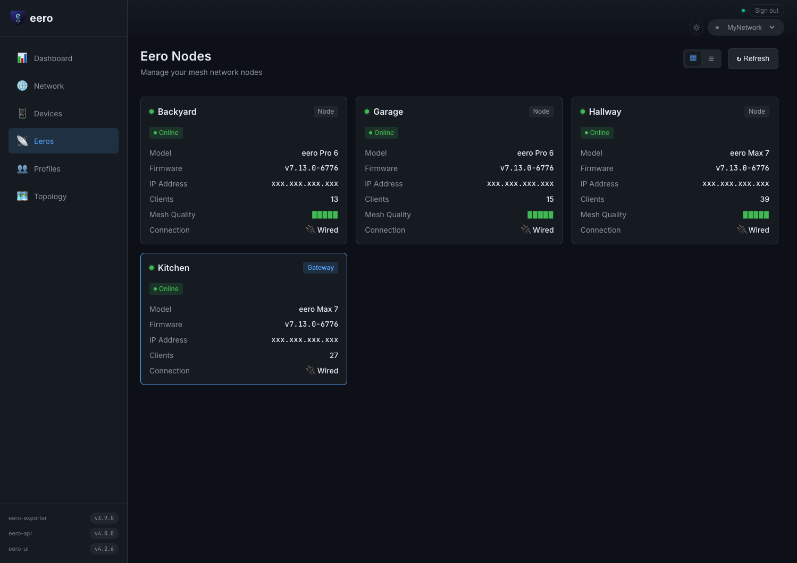
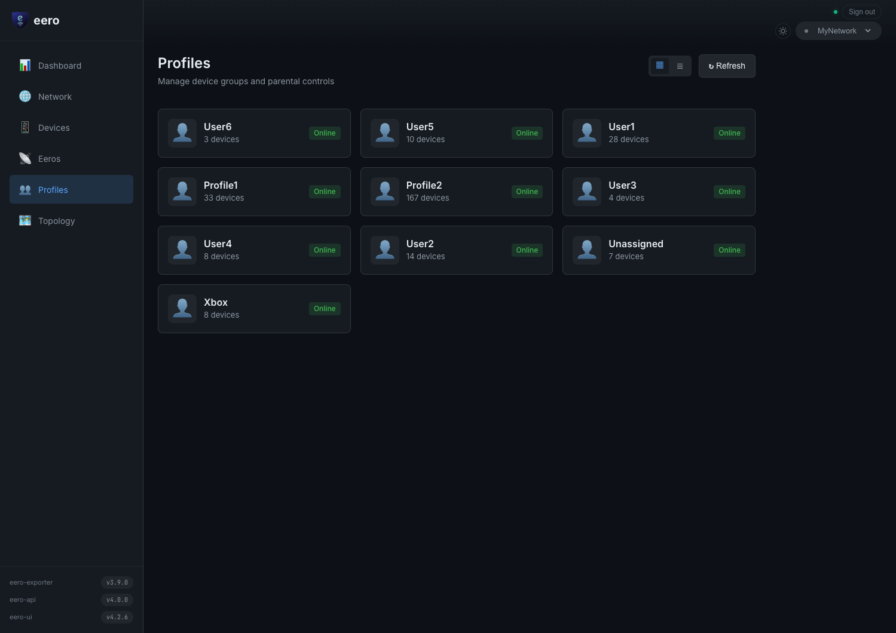
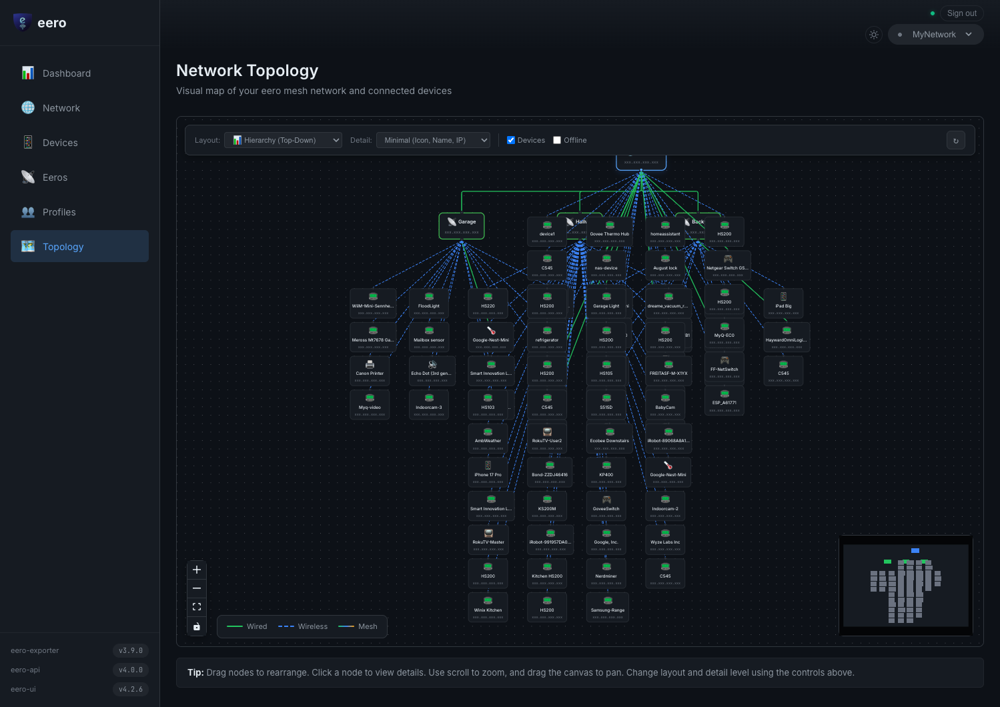
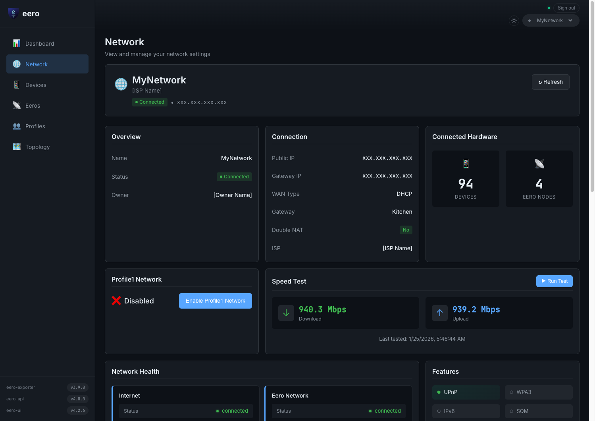
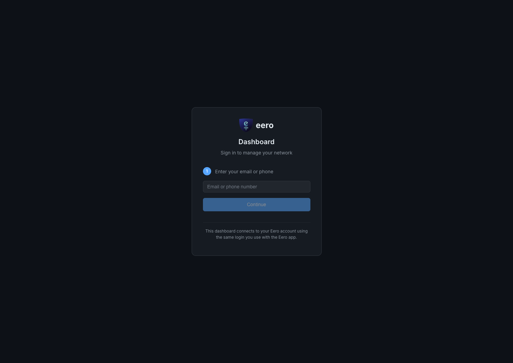

<div align="center">

# 🖥️ Eero UI

**A sleek dashboard for managing your Eero mesh network**

[](https://svelte.dev)
[](https://fastapi.tiangolo.com)
[](https://ghcr.io/fulviofreitas/eero-ui)
[](LICENSE)

---

_A modern, responsive web dashboard for Eero network management._  
_Built for operators who want fast, efficient network control._

[Get Started](#-quick-start) · [Documentation](#-documentation) · [Features](#-features) · [License](#-license)

</div>

---

## 📸 Screenshots

| Dark Theme | Light Theme |
|:----------:|:-----------:|
|  |  |

| Devices | Eeros | Profiles |
|:-------:|:-----:|:--------:|
|  |  |  |

| Topology | Network | Login |
|:--------:|:-------:|:-----:|
|  |  |  |

---

## ✨ Features

| 📊 Monitor | 🎛️ Control | 🎨 Experience |
|-----------|-----------|--------------|
| Network health & speed tests | Block/unblock devices | Dark theme dashboard |
| Device listing & search | Pause/unpause profiles | Real-time filtering |
| Eero node status | Reboot nodes | Optimistic UI updates |

---

## 🚀 Quick Start

```bash
# Pull and run
docker run -d --name eero-ui -p 8000:8000 \
  -v eero-data:/data \
  -e EERO_DASHBOARD_SESSION_SECRET=$(openssl rand -hex 32) \
  ghcr.io/fulviofreitas/eero-ui:latest
```

Open **http://localhost:8000** 🎉

> 💡 Or clone & run locally: `./start.sh`

---

## 📚 Documentation

Full documentation lives in the **[Wiki](../../wiki)**:

| 📖 Guide | Description |
|----------|-------------|
| [🚀 Installation](../../wiki/Installation) | Docker & manual setup |
| [⚙️ Configuration](../../wiki/Configuration) | Environment variables |
| [🏗️ Architecture](../../wiki/Architecture) | System design & auth flow |
| [📡 API Reference](../../wiki/API-Reference) | REST endpoints |
| [🔒 Security](../../wiki/Security) | Best practices |
| [🛠️ Development](../../wiki/Development) | Local dev & testing |
| [🔄 CI/CD](../../wiki/CI-CD) | GitHub Actions workflows |
| [🔧 Troubleshooting](../../wiki/Troubleshooting) | Common issues |
| [🗺️ Roadmap](../../wiki/Roadmap) | Future plans |

---

## 🔗 Related

- **[eero-api](https://github.com/fulviofreitas/eero-api)** — Async Python SDK for Eero API

---

## 📄 License

[MIT](LICENSE) — Use freely, contribute gladly!

---

<div align="center">

## 📊 Repository Metrics


</div>
