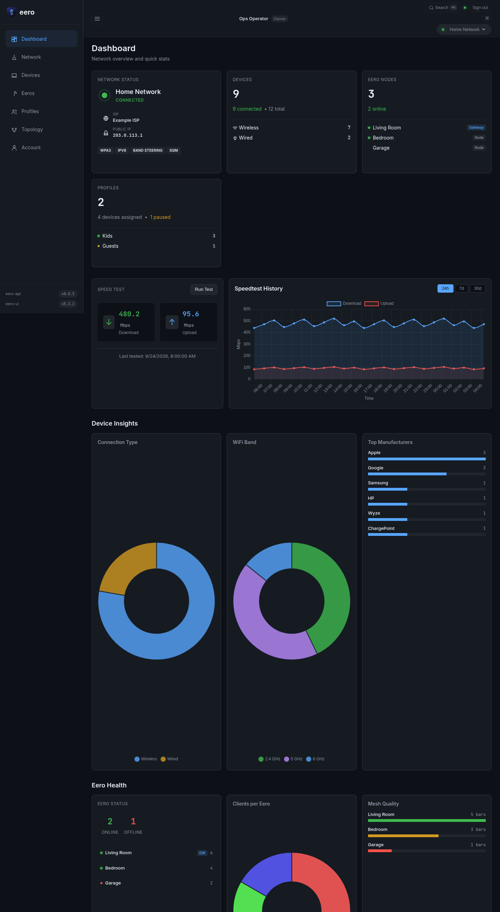
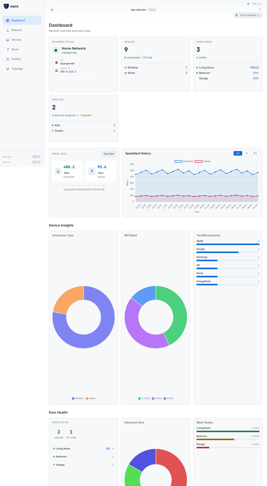
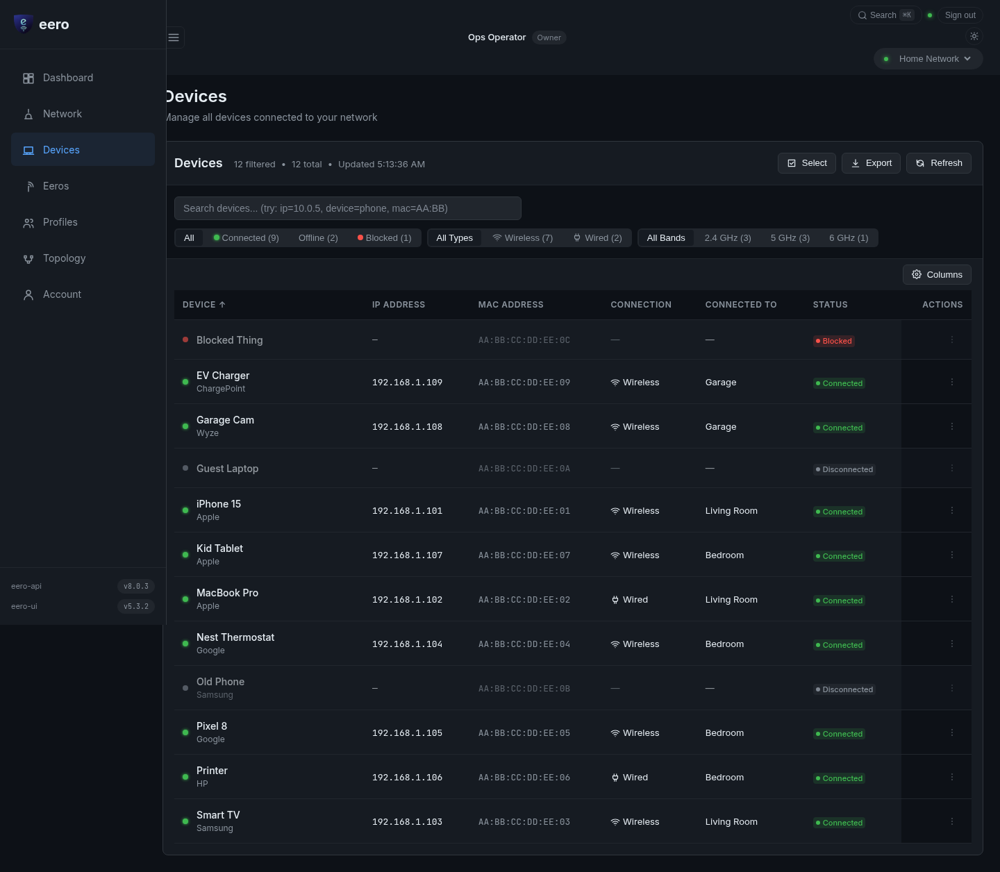
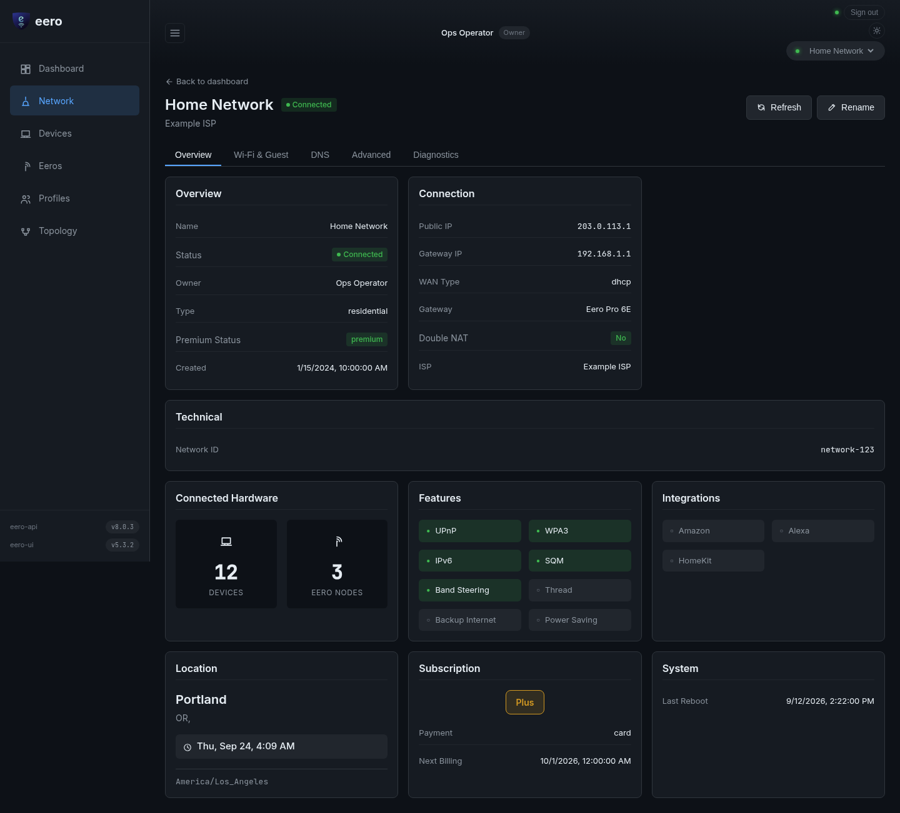
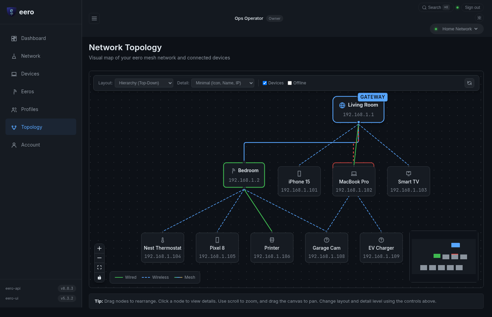

<div align="center">

# 🖥️ Eero UI

**A sleek dashboard for managing your Eero mesh network**

[](https://svelte.dev)
[](https://fastapi.tiangolo.com)
[](https://ghcr.io/fulviofreitas/eero-ui)
[](LICENSE)

---

_A modern, responsive web dashboard for Eero network management._  
_Built for operators who want fast, efficient network control._

[Get Started](#-quick-start) · [Documentation](#-documentation) · [Features](#-features) · [License](#-license)

</div>

---

## 📸 Screenshots

| Dark Theme | Light Theme |
|:----------:|:-----------:|
|  |  |

| Devices | Network | Topology |
|:-------:|:-------:|:--------:|
|  |  |  |

Every route, in both themes, at desktop and phone widths — plus before/after captures from the 5.x UI — is indexed in [`docs/screenshots/6.0/README.md`](./docs/screenshots/6.0/README.md).

---

## ✨ Features

| 📊 Monitor | 🎛️ Control | 🎨 Experience |
|-----------|-----------|--------------|
| Network health, speed tests and history | Reboot nodes, LED on/off and brightness | Dark and light themes, no flash on load |
| Device table: sort, search, filter, export | Block/unblock, rename and retype devices | Skeleton loading, keyboard-accessible tables |
| Eero node status and mesh quality | Guest network, password, DNS | Optimistic updates where safe, confirmations where not |
| Built-in metrics: clients, signal, speed over time | Profiles, schedules, content filter, forwards, reservations | Interactive network topology map |
| Insights, data usage, events, channel utilisation (premium) | Advanced settings: SQM, DHCP, WPA3, WAN, power saving | Expired-session detection and clear error states |

Writes that have not been verified end-to-end against a live eero network are hidden behind `EERO_DASHBOARD_EXPERIMENTAL_WRITES` — see the [Roadmap](../../wiki/Roadmap) for exactly which ones.

---

## 🚀 Quick Start

```bash
# Pull and run
docker run -d --name eero-ui -p 8000:8000 \
  -v eero-data:/data \
  -e EERO_DASHBOARD_SESSION_SECRET=$(openssl rand -hex 32) \
  ghcr.io/fulviofreitas/eero-ui:latest
```

Open **http://localhost:8000** 🎉

> 💡 Or clone & run locally: `./start.sh`

### One container, batteries included

The image runs two processes: the FastAPI backend (which also serves the built Svelte app and runs the metrics collector) and an embedded [VictoriaMetrics](https://victoriametrics.com/) store, bound to loopback. eero-ui collects its own metrics from the eero API and writes them into that store; the charts read them back. Nothing is scraped, nothing else needs to be deployed, and nothing but port 8000 is exposed.

### Optional: the Prometheus exporter

If you want the full 90+ metric set from [eero-prometheus-exporter](https://github.com/fulviofreitas/eero-prometheus-exporter) for your own Prometheus, run `ghcr.io/fulviofreitas/eero-prometheus-exporter:4.0.0` alongside — a commented-out service is in `docker-compose.yml`. It has its own login and its own credential file, and eero-ui does not depend on it in any way. See the [Metrics](../../wiki/Metrics) page.

### Upgrading from 5.x

6.0 is a breaking major: the exporter is gone from the image, `/metrics` is removed, `/api/metrics/*` requires a session, and `EERO_EXPORTER_SESSION_PATH` / `EERO_DASHBOARD_METRICS_ENDPOINT_ENABLED` no longer exist. Existing metric history stays continuous. Back up the `eero-data` volume first, then follow [Configuration → Upgrading to 6.0](../../wiki/Configuration#upgrading-to-60).

---

## 📚 Documentation

Full documentation lives in the **[Wiki](../../wiki)**:

| 📖 Guide | Description |
|----------|-------------|
| [🚀 Installation](../../wiki/Installation) | Docker & manual setup |
| [⚙️ Configuration](../../wiki/Configuration) | Environment variables, write gates, upgrading to 6.0 |
| [🏗️ Architecture](../../wiki/Architecture) | Two-process container, metrics pipeline, auth, error mapping |
| [📈 Metrics](../../wiki/Metrics) | The metric contract, collection, the optional exporter |
| [📡 API Reference](../../wiki/API-Reference) | Every REST endpoint with gates, limits and status codes |
| [🔒 Security](../../wiki/Security) | Credential file, CSRF, gates, metrics surface |
| [🛠️ Development](../../wiki/Development) | Local dev & testing |
| [🔄 CI/CD](../../wiki/CI-CD) | GitHub Actions workflows |
| [🔧 Troubleshooting](../../wiki/Troubleshooting) | Expired sessions, empty charts, error types, rollback |
| [🗺️ Roadmap](../../wiki/Roadmap) | Write verification status and future plans |

---

## 🔗 Related

- **[eero-api](https://github.com/fulviofreitas/eero-api)** — Async Python SDK for the eero API (v8)
- **[eero-prometheus-exporter](https://github.com/fulviofreitas/eero-prometheus-exporter)** — optional, standalone Prometheus exporter

---

## 📄 License

[MIT](LICENSE) — Use freely, contribute gladly!

---

<div align="center">

## 📊 Repository Metrics


</div>
