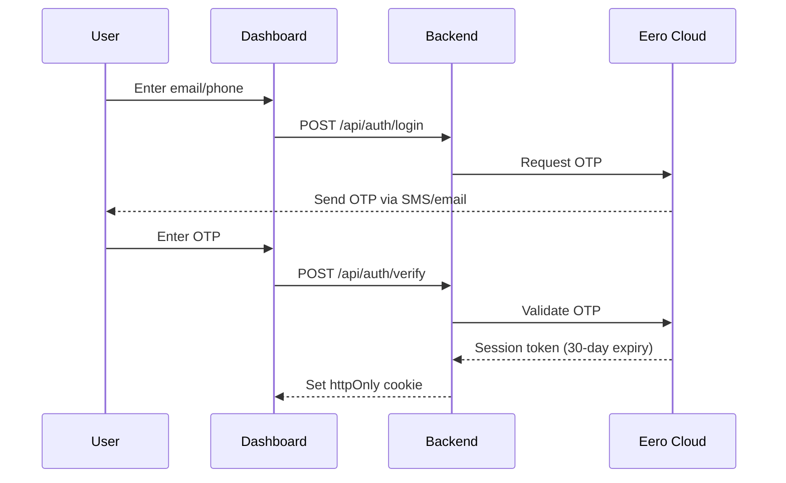

# 🏗️ Architecture

## System Overview

```
┌─────────────────────────────────────────────────────────────┐
│                    Svelte Frontend (SPA)                     │
│  ┌─────────┐  ┌─────────┐  ┌─────────┐  ┌─────────┐        │
│  │  Views  │  │Componts │  │ Stores  │  │   API   │        │
│  └────┬────┘  └────┬────┘  └────┬────┘  └────┬────┘        │
│       └────────────┴────────────┴────────────┘              │
└─────────────────────────────┬───────────────────────────────┘
                              │ HTTP/REST
                              ▼
┌─────────────────────────────────────────────────────────────┐
│                    FastAPI Backend                           │
│                 (wraps eero-client SDK)                      │
└─────────────────────────────┬───────────────────────────────┘
                              │ HTTPS
                              ▼
                    ┌──────────────────┐
                    │  Eero Cloud API  │
                    └──────────────────┘
```

## Why a Backend Proxy?

| Benefit | Description |
|---------|-------------|
| 🔒 **Security** | Eero session tokens stay server-side, never exposed to browser |
| ♻️ **Reuse** | Leverages existing [eero-client](https://github.com/fulviofreitas/eero-client) Python SDK |
| ⚡ **Caching** | Backend can cache API responses (60s TTL) |
| 🛡️ **Rate Limiting** | Protects against accidental API abuse |

## Code Structure

```
eero-ui/
├── backend/
│   ├── app/
│   │   ├── main.py         # FastAPI app
│   │   ├── config.py       # Configuration
│   │   ├── deps.py         # Dependencies (auth, client)
│   │   └── routes/         # API endpoints
│   └── pyproject.toml
│
└── frontend/
    ├── src/
    │   ├── lib/
    │   │   ├── api/        # API client
    │   │   ├── stores/     # Svelte stores
    │   │   └── components/ # UI components
    │   └── routes/         # Pages
    └── package.json
```

## Authentication Flow


