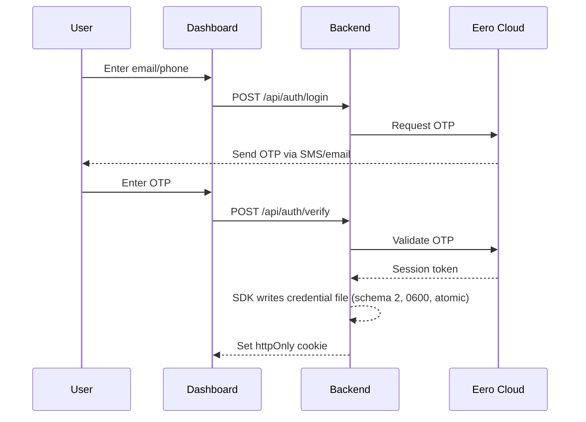

# 🏗️ Architecture

## System Overview

```
┌─────────────────────────────────────────────────────────────┐
│                    Svelte Frontend (SPA)                     │
│  ┌─────────┐  ┌─────────┐  ┌─────────┐  ┌─────────┐        │
│  │  Views  │  │Componts │  │ Stores  │  │   API   │        │
│  └────┬────┘  └────┬────┘  └────┬────┘  └────┬────┘        │
│       └────────────┴────────────┴────────────┘              │
└─────────────────────────────┬───────────────────────────────┘
                              │ HTTP/REST (/api/*)
                              ▼
┌─────────────────────────────────────────────────────────────┐
│                    FastAPI Backend                           │
│   routes/ ── deps.py ── EeroClient (eero-api SDK)            │
│   services/collector.py ──write──► VictoriaMetrics ◄──read── │
│                                     services/victoria.py     │
└─────────────────────────────┬───────────────────────────────┘
                              │ HTTPS
                              ▼
                    ┌──────────────────┐
                    │  Eero Cloud API  │
                    └──────────────────┘
```

## Why a Backend Proxy?

| Benefit | Description |
|---------|-------------|
| 🔒 **Security** | Eero session tokens stay server-side, never exposed to browser |
| ♻️ **Reuse** | Leverages existing [eero-api](https://github.com/fulviofreitas/eero-api) Python SDK |
| ⚡ **Caching** | Backend caches API responses (60s TTL) |
| 🛡️ **Rate Limiting** | Protects against accidental API abuse |

## Container Shape

The Docker image runs **two** processes, supervised by `container-start.sh` as PID 1:

```
[FastAPI :8000, published] ──writes──► [VictoriaMetrics :8428, loopback only, storage only]
        ▲                                        │
        └──────────────── reads ─────────────────┘
```

- **VictoriaMetrics** is started with a storage path, retention and `-httpListenAddr=127.0.0.1:8428` only. It has no `-promscrape.config`; nothing is scraped.
- **FastAPI** hosts the REST API, serves the built SPA, and runs the metrics collector.
- `container-start.sh` waits up to 30 s for VictoriaMetrics to answer `/health` (a timeout is a warning, not fatal), forwards `SIGTERM` to both children on `docker stop`, and exits non-zero if either child dies so Docker's restart policy applies.

The `eero-prometheus-exporter` is **not** part of the image, the Python environment or the runtime. See [[Metrics]] for running it as an optional, wholly separate container.

## Metrics Pipeline

```
MetricsCollector (asyncio task in the FastAPI lifespan)
   │  every EERO_DASHBOARD_COLLECTION_INTERVAL seconds
   │  reads through the shared EeroClient + transformers.py
   ▼
VictoriaMetricsClient.write()  ──POST /api/v1/import (NDJSON)──►  VictoriaMetrics
                                                                        │
routes/metrics.py  ◄── VictoriaMetricsClient.query_range() ◄────────────┘
   │
   ▼
SpeedtestChart / ClientCountChart / signal history
```

The collector reads every network on the account, normalises with the same `transformers.py` the routes use, and writes one batch per cycle with a single timestamp. `VictoriaMetricsClient` holds one shared `httpx.AsyncClient` that is closed on shutdown. Failures are logged, counted into `eero_collector_errors_total{reason}` and reported by `GET /api/metrics/health`; they never reach the request path.

The **metric contract** — eight metric names with exact label sets, preserved from the exporter so history stays continuous — is documented in [[Metrics]].

## Authentication


```mermaid
sequenceDiagram
    participant User
    participant Dashboard
    participant Backend
    participant Eero Cloud

    User->>Dashboard: Enter email/phone
    Dashboard->>Backend: POST /api/auth/login
    Backend->>Eero Cloud: Request OTP
    Eero Cloud-->>User: Send OTP via SMS/email
    User->>Dashboard: Enter OTP
    Dashboard->>Backend: POST /api/auth/verify
    Backend->>Eero Cloud: Validate OTP
    Eero Cloud-->>Backend: Session token
    Backend-->>Backend: SDK writes credential file (schema 2, 0600, atomic)
    Backend-->>Dashboard: Set httpOnly cookie
```

- The eero session token is sent to the eero cloud as the `X-User-Token` request header by the SDK. The legacy `s=` cookie transport is off unless `EERO_DASHBOARD_SDK_LEGACY_COOKIE=true`.
- One `EeroClient` singleton (`deps.py`) is shared by every route and the collector. It is built with `use_keyring=False` (pinned: single-file storage, no keyring fallback chain), `send_legacy_cookie` and `get_retries` from settings.
- `require_auth` is the cheap gate: "a token exists on disk". `GET /api/auth/status` is the truthful one: it probes `get_account()` and reports `reason: "expired"` (clearing the token) when the cloud rejects the session.

## Exception Layer

`main.py` registers one FastAPI handler per `eero-api` exception class, so routes no longer wrap SDK errors into a blanket 500. The SDK message is never surfaced; `detail` is a static string.

| SDK exception | HTTP | Body extras |
|---|---|---|
| `EeroAuthenticationException` | 401 | `reason: "expired"`, token cleared, `WWW-Authenticate: Bearer` |
| `EeroNotFoundException` | 404 | |
| `EeroAccessDeniedException` | 403 | |
| `EeroPremiumRequiredException` | 402 | `type: "premium_required"` |
| `EeroFeatureUnavailableException` | 409 | `type: "feature_unavailable"`, `error_code` |
| `EeroClientBlockedException` | 503 | |
| `EeroRateLimitException` | 429 | `Retry-After: 60` |
| `EeroValidationException` | 422 | `detail: {field, message}` |
| `EeroNetworkException`, `EeroTimeoutException` | 503 | |
| `EeroAPIException` | 502 | `error_code`/`status_code` logged; envelope only at DEBUG |
| `EeroException` | 500 | generic |

Two eero-ui-specific exceptions use the same shape: `ExperimentalWriteDisabledError` → `403 {"type": "experimental_disabled"}` and `AccountIdentityWriteDisabledError` → `403 {"type": "account_identity_disabled"}`.

## Request Guards

- **CSRF** — a middleware rejects every `POST`/`PUT`/`PATCH`/`DELETE` under `/api/` that does not carry `X-Requested-With: eero-ui` with `403 {"type": "csrf"}`. A cross-site form or `no-cors` fetch cannot set that header. `GET`/`HEAD`/`OPTIONS` are exempt.
- **Path identifiers** — every `{network_id}`, `{eero_id}`, `{profile_id}` and `{device_id}` is validated by a router-level dependency (`validate_request_path_ids`) against the SDK's identifier grammar before any SDK call or PromQL selector is built; a bad value is a static `400`.
- **Write gates** — `require_experimental_writes` and `require_account_identity_writes` (`deps.py`) implement `EERO_DASHBOARD_EXPERIMENTAL_WRITES` and `EERO_DASHBOARD_ACCOUNT_IDENTITY_WRITES`. Settings-class routes in `networks.py` each depend on their own module-level gate constant (`_SQM_GATE`, `_DHCP_GATE`, …) so a family can be opened independently once it is live-verified.
- **Rate limits** — slowapi, keyed by remote address: `5/minute` on login and verify; shared scopes such as `settings_writes` (2/minute), `experimental_writes` (10/minute), `speedtest` (2/minute). Shared scopes are used deliberately: a per-path limit is bypassable by varying the path parameter.
- **Passthrough hygiene** — routes that return an undocumented raw payload from the SDK pass it through `strip_sensitive_keys`, which removes any key that looks like a password, PSK, token, secret, PIN or verification code.

## Code Structure

```
eero-ui/
├── backend/
│   ├── app/
│   │   ├── main.py         # FastAPI app, lifespan, exception handlers, CSRF guard
│   │   ├── config.py       # Settings (EERO_DASHBOARD_*)
│   │   ├── deps.py         # EeroClient singleton, auth and write gates
│   │   ├── transformers.py # Raw API → normalised models, identifier validation
│   │   ├── routes/         # auth, networks, devices, eeros, profiles, metrics, account
│   │   └── services/
│   │       ├── collector.py   # MetricsCollector
│   │       └── victoria.py    # VictoriaMetricsClient (write + read)
│   └── pyproject.toml
├── container-start.sh      # two-process supervisor
├── scripts/
│   ├── smoke-test-image.sh          # § 8.4 image smoke test
│   ├── check-history-continuity.sh  # metric continuity across the upgrade
│   └── live-verify.py               # read-only snapshot/diff for live verification
└── frontend/
    ├── src/
    │   ├── lib/
    │   │   ├── api/        # API client (writes use retries: 0)
    │   │   ├── stores/     # Svelte stores; settingsLock.ts holds the per-network applying lock
    │   │   ├── charts/     # shared Chart.js defaults and theming
    │   │   └── components/ # common/ primitives + feature components
    │   └── routes/         # Pages
    └── package.json
```
