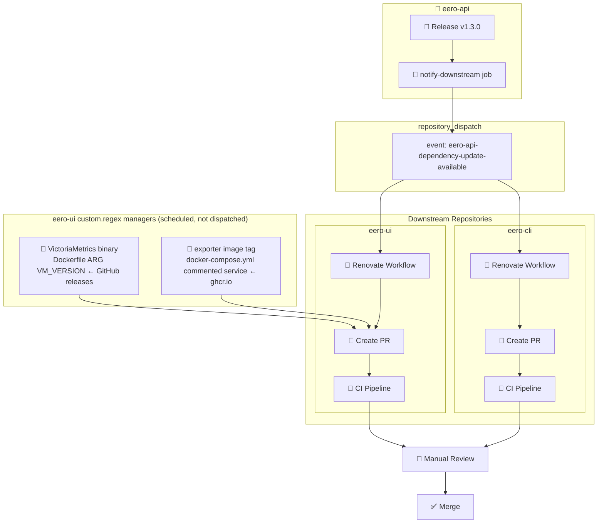
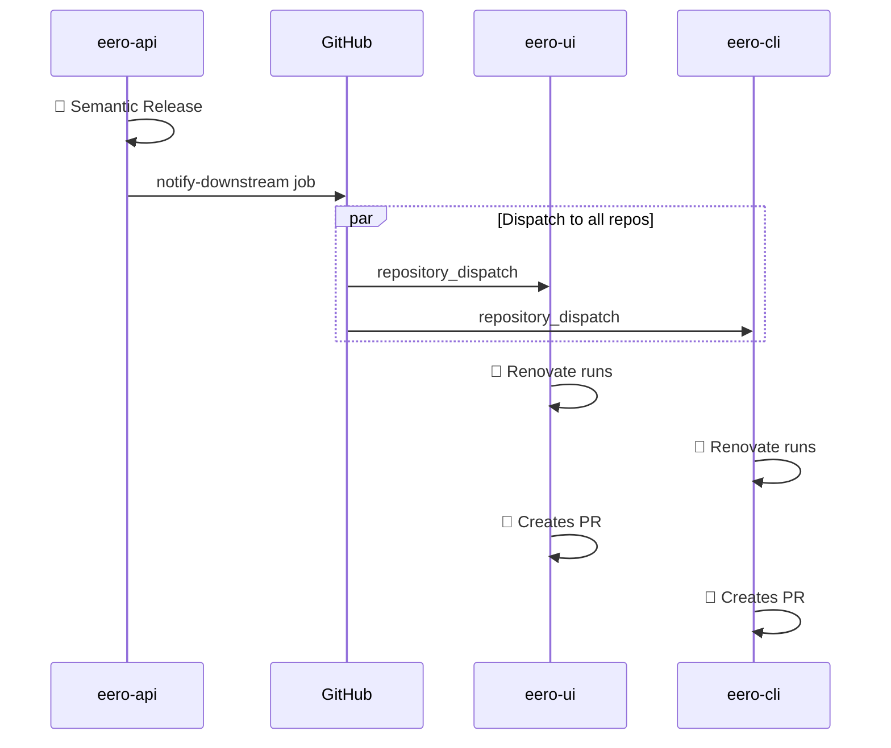

# Dependency Updates

This project uses **Renovate** with a **GitHub App** for automated dependency management. The configuration is **standardized across all eero-ecosystem repositories**.

## Overview

The dependency update system automatically:
- Tracks new releases of `eero-api` (the core API client), capped below `9.0.0`
- Tracks the pinned VictoriaMetrics binary (`Dockerfile`) via GitHub releases
- Tracks the documented `eero-prometheus-exporter` image tag in the optional, commented-out compose service
- Creates PRs **immediately** when dependencies have updates available
- Auto-merges minor/patch updates for non-critical dependencies
- Requires manual review for `eero-api` and major updates
- Triggers instantly when `eero-api` releases a new version

Since 6.0 the exporter is **not** a dependency of eero-ui — it appears in Renovate only as a documented image tag (see [Custom Managers](#custom-managers-regex)).

## Ecosystem Repositories

The Renovate configuration is standardized across all repositories:

| Repository | eero-api Tracking | npm Tracking | Config File |
|:-----------|:---------------------|:-------------|:------------|
| **eero-api** | ❌ N/A (is eero-api) | ❌ No | [renovate.json5](https://github.com/fulviofreitas/eero-api/blob/master/.github/renovate.json5) |
| **eero-cli** | ✅ `^pyproject\.toml$` | ❌ No | [renovate.json5](https://github.com/fulviofreitas/eero-cli/blob/master/.github/renovate.json5) |
| **eero-ui** | ✅ `^backend/pyproject\.toml$` (`allowedVersions: "<9.0.0"`) | ✅ Yes | [renovate.json5](https://github.com/fulviofreitas/eero-ui/blob/master/.github/renovate.json5) |

`eero-prometheus-exporter` is a separate project with its own Renovate setup; it is no longer part of eero-ui's dependency chain.

---

## Architecture

```mermaid
flowchart TB
    subgraph eero-api ["🔧 eero-api"]
        release["🚀 Release v1.3.0"]
        notify["🔔 notify-downstream job"]
        release --> notify
    end

    subgraph dispatch ["repository_dispatch"]
        event["event: eero-api-dependency-update-available"]
    end

    notify --> event

    subgraph downstream ["Downstream Repositories"]
        subgraph ui ["eero-ui"]
            ui_renovate["🔄 Renovate Workflow"]
            ui_pr["📝 Create PR"]
            ui_ci["🧪 CI Pipeline"]
            ui_renovate --> ui_pr --> ui_ci
        end

        subgraph cli ["eero-cli"]
            cli_renovate["🔄 Renovate Workflow"]
            cli_pr["📝 Create PR"]
            cli_ci["🧪 CI Pipeline"]
            cli_renovate --> cli_pr --> cli_ci
        end
    end

    event --> ui_renovate
    event --> cli_renovate

    ui_ci --> review["👀 Manual Review"]
    cli_ci --> review

    review --> merge["✅ Merge"]

    subgraph regex ["eero-ui custom.regex managers (scheduled, not dispatched)"]
        vm["🔷 VictoriaMetrics binary<br/>Dockerfile ARG VM_VERSION ← GitHub releases"]
        exp_tag["🔷 exporter image tag<br/>docker-compose.yml commented service ← ghcr.io"]
    end

    vm --> ui_pr
    exp_tag --> ui_pr
```

---

## Standardized Configuration

All repositories use the same base configuration. See the config files linked above for the full implementation.

### Key Settings

| Setting | Value | Description |
|:--------|:------|:------------|
| **Schedule** | `at any time` | PRs created immediately (no delay) |
| **PR Limits** | `0` | No rate limiting |
| **Branch Prefix** | `deps/` | All dependency branches |
| **Commit Prefix** | `chore(deps):` | Semantic commit format |
| **Dashboard** | Enabled | With autoclose when no updates |

---

## Package Rules

### Summary Table

| Rule | Auto-merge | Commit Prefix | Labels |
|:-----|:-----------|:--------------|:-------|
| 🔴 **eero-api** | ❌ No | `chore(deps-critical):` | `critical`, `needs-review`, `eero-api` |
| 🟡 **Python minor/patch** | ✅ Squash | `chore(deps-python):` | `automerge` |
| 🟡 **npm minor/patch** | ✅ Squash | `chore(deps-npm):` | `automerge` |
| 🟢 **GitHub Actions** | ✅ Squash | `chore(deps-actions):` | `automerge` |
| 🔷 **VictoriaMetrics binary** (minor/patch) | ✅ Squash | `chore(deps-vm):` | `victoria-metrics` |
| 🔷 **eero-prometheus-exporter documented tag** (minor/patch) | ✅ Squash | `docs(deps):` | `eero-packages` |
| 🔵 **Major updates** | ❌ No | `chore(deps-major):` | `major-update`, `needs-review` |
| 🟣 **Security patches** | Priority 20 | - | - |
| 🚨 **Vulnerability alerts** | ✅ Yes | - | `security`, `critical` |

### eero-api Updates

When Renovate detects a new eero-api version:

- **Commit Message**: `chore(deps-critical): update eero-api v1.3.0`
- **Labels**: `critical`, `needs-review`, `eero-api`, `dependencies`
- **Reviewers**: Automatically assigned to maintainers
- **Assignees**: Automatically assigned for accountability
- **PR Body**: Includes review checklist and relevant links

### Major Updates

All major version updates (any dependency):
- Labeled with `major-update`, `needs-review`
- Automatically request review from maintainers
- Never auto-merged

## Custom Managers (regex)

Two versions have no native package manager, so `enabledManagers` includes `custom.regex` and `customManagers` defines one matcher each:

| Manager | Where it looks | Source of new versions | Why |
|:--------|:---------------|:-----------------------|:----|
| **VictoriaMetrics binary** | `Dockerfile` `ARG VM_VERSION=v1.96.0` in the `vm-downloader` stage | GitHub releases of `VictoriaMetrics/VictoriaMetrics` (v-prefixed tags, kept like-for-like via `extractVersionTemplate`) | The embedded time-series store was untracked before 6.0. Minor/patch auto-merge; majors go through the generic major-updates rule |
| **eero-prometheus-exporter image tag** | the commented-out `eero-exporter` service in `docker-compose.yml` (`image: ghcr.io/fulviofreitas/eero-prometheus-exporter:4.0.0`) | ghcr.io tags | eero-ui does not run or depend on the exporter; this only keeps the documented known-good tag current for operators who opt in. Minor/patch auto-merge with a `docs(deps):` prefix |

---

## Cross-Repository Dispatch

When `eero-api` releases a new version, it automatically notifies all downstream repositories via `repository_dispatch`.

### Flow

```mermaid
sequenceDiagram
    participant EC as eero-api
    participant GH as GitHub
    participant UI as eero-ui
    participant CLI as eero-cli

    EC->>EC: 🚀 Semantic Release
    EC->>GH: notify-downstream job
    
    par Dispatch to all repos
        GH->>UI: repository_dispatch
        GH->>CLI: repository_dispatch
    end

    UI->>UI: 🔄 Renovate runs
    CLI->>CLI: 🔄 Renovate runs

    UI->>UI: 📝 Creates PR
    CLI->>CLI: 📝 Creates PR
```

The two regex-managed versions (VictoriaMetrics binary, exporter image tag) are picked up on the scheduled and manual runs only; there is no cross-repository dispatch for them.

### Workflow Files

| Repository | Release Workflow | Renovate Workflow |
|:-----------|:-----------------|:------------------|
| **eero-api** | [release.yml](https://github.com/fulviofreitas/eero-api/blob/master/.github/workflows/release.yml) | [renovate.yml](https://github.com/fulviofreitas/eero-api/blob/master/.github/workflows/renovate.yml) |
| **eero-cli** | [release.yml](https://github.com/fulviofreitas/eero-cli/blob/master/.github/workflows/release.yml) | [renovate.yml](https://github.com/fulviofreitas/eero-cli/blob/master/.github/workflows/renovate.yml) |
| **eero-ui** | [release.yml](https://github.com/fulviofreitas/eero-ui/blob/master/.github/workflows/release.yml) | [renovate.yml](https://github.com/fulviofreitas/eero-ui/blob/master/.github/workflows/renovate.yml) |

---

## Workflow Triggers

| Trigger | When | Result |
|:--------|:-----|:-------|
| `repository_dispatch` | eero-api releases | Immediate PR creation |
| `schedule` | Weekly (Mondays 3 AM UTC) | Checks all dependencies |
| `workflow_dispatch` | Manual run | On-demand check |

---

## Manual Trigger

To run Renovate manually:

1. Go to **Actions** → **🔄 Renovate**
2. Click **Run workflow**
3. Options:
   - **Dry-run mode**: Preview changes without creating PRs
   - **Log level**: Set to `debug` for troubleshooting
   - **Reset cache**: Clear cached data for fresh run

---

## Dependency Dashboard

Renovate creates a **Dependency Dashboard** issue that shows:
- All detected dependencies
- Pending updates
- Config warnings
- Manual override checkboxes

The dashboard is auto-closed when there are no more updates (`dependencyDashboardAutoclose: true`).

You can force-create any PR by checking its checkbox in the dashboard.

---

## Auto-Merge Workflow

Renovate's auto-merge works with the repository's auto-merge workflow:

1. Renovate creates PR with `automerge` label
2. CI pipeline runs and passes
3. Auto-merge workflow detects the label
4. PR is automatically merged (squash strategy)

### Auto-Merge Labels

| Label | Description |
|:------|:------------|
| `automerge` | Added by Renovate for auto-mergeable PRs |
| `dependencies` | All Renovate PRs |
| `renovate` | All Renovate PRs |

---

## Repository Caching

The Renovate workflow includes repository caching for faster subsequent runs.

- **Retention**: 7 days
- **Reset cache**: Use the "Reset repository cache" option in manual workflow dispatch
- **Cache key**: `renovate-cache-v1` (bump version in workflow to bust cache)
